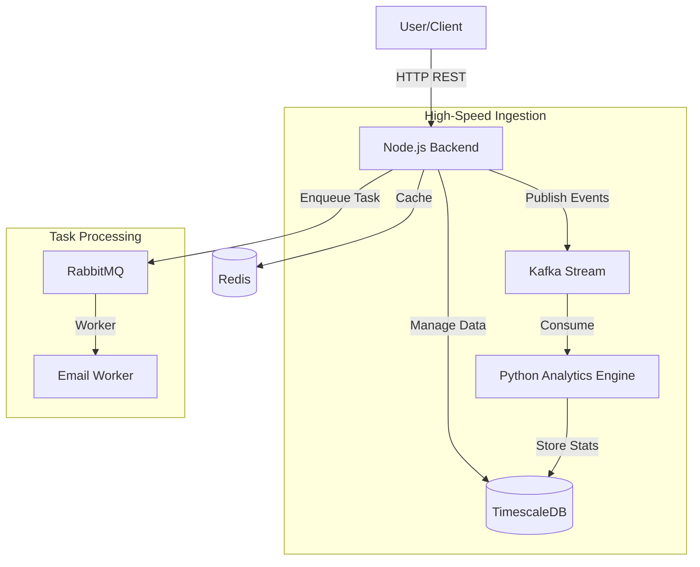

# RailRover

> **Enterprise-Grade Railway Booking System**
> High-scale, real-time hybrid architecture powered by Node.js, Python, Kafka, and RabbitMQ.

[](https://nodejs.org/)
[](https://python.org/)
[](https://kafka.apache.org/)
[](https://www.docker.com/)

---

## System Architecture

RailRover is designed to mimic high-performance real-world systems like Ticketmaster or Uber, capable of handling burst traffic and complex background processing.



### Core Components
| Service | Tech Stack | Responsibility |
|:---|:---|:---|
| **API Gateway** | Node.js (Express) | Handles user requests, authentication, and orchestration. |
| **Analytics Engine** | Python (Pandas) | Real-time consumption of Kafka streams for revenue/traffic stats. |
| **Event Bus** | Apache Kafka | High-throughput stream for Bookings and Waitlist (Burst traffic). |
| **Task Queue** | RabbitMQ | Reliable, ordered processing for Emails and Notifications. |
| **Database** | TimescaleDB | PostgreSQL extension for efficient time-series data related to schedules. |

---

## Key Features

### 1. **Burst-Ready Booking System**
Uses **Kafka** to handle thousands of requests per second. If a train is full, requests are seamlessly streamed to a `waitlist-events` topic instead of crashing the server.

### 2. **Real-Time Analytics**
A dedicated **Python Microservice** watches the booking stream. It instantly calculates revenue metrics and occupancy rates, storing them in TimescaleDB for visualization in **Grafana**.

### 3. **Smart Waitlist (First-In-First-Out)**
Users are added to a strictly ordered Kafka topic. When a cancellation occurs, the system automatically processes the stream to promote the next user in line.

### 4. **Asynchronous Notifications**
Heavy tasks like generating PDF tickets or sending emails are offloaded to **RabbitMQ**, ensuring the user interface remains snappy.

---

## Quick Start

### Prerequisites
- Docker & Docker Compose
- 8 GB RAM (recommended)

### Installation
1.  **Clone the Repo**:
    ```bash
    git clone https://github.com/Dhanush-sai-reddy/Train-Ticket-booking-system.git
    cd Train-Ticket-booking-system
    ```

2.  **Start Services**:
    ```bash
    docker-compose up --build
    ```
    *This brings up: Backend, Analytics, Postgres, Redis, Kafka, Zookeeper, RabbitMQ, Grafana.*

3.  **Seed Data** (Optional):
    ```bash
    docker-compose --profile seed up data-seeder
    ```

### Access Points
- **API**: `http://localhost:3001`
- **Grafana (Dashboards)**: `http://localhost:3002` (User/Pass: `admin`/`admin`)
- **RabbitMQ (Queue Manager)**: `http://localhost:15672` (User/Pass: `railrover`/`railrover_pass`)

---

## Future Roadmap

We are constantly evolving RailRover. Here is what's coming next:

### Phase 1: Stability (Current)
- [x] Hybrid Microservices (Node + Python)
- [x] Event Streaming implementation
- [x] Docker Orchestration

### Phase 2: User Experience (Next)
- [ ] **Frontend**: React/Next.js dashboard for users to book tickets visually.
- [ ] **Real-time Websockets**: Push notifications to the browser when a Waitlist seat confirms.
- [ ] **Payment Gateway**: Integration with Stripe/Razorpay for actual payments.

### Phase 3: Infinite Scale
- [ ] **Kubernetes (K8s) Deployment**: Helm charts for auto-scaling the Node.js API.
- [ ] **Sharding**: Splitting the database by "Railway Zone" (North/South/East/West).
- [ ] **Geo-Redundancy**: Deploying Kafka clusters across multiple availability zones.

---

## License
MIT License. Built for scalability.
